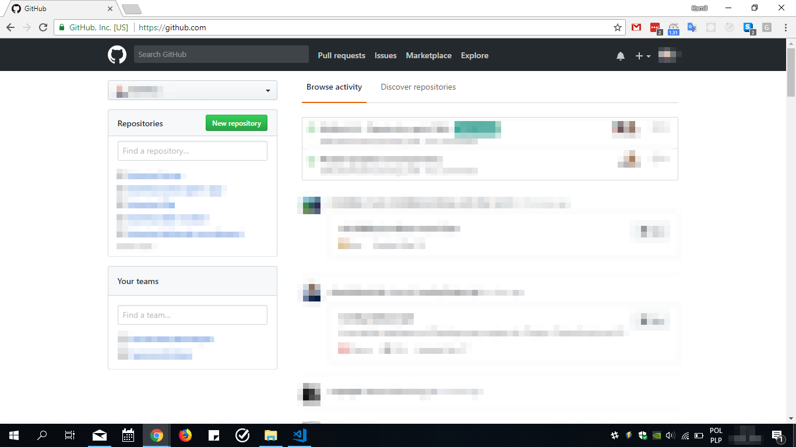
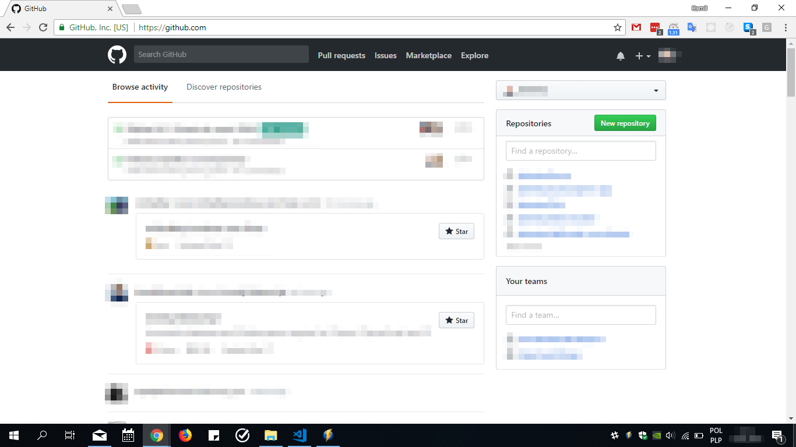

# GitHubFix
Reverse GitHub.com site changes made in May 2018.

The plugin places the right column in the right place.

## What it fixes?

New dashboard

Old (better) dashboard

## Installation

1. Download REPO
2. GOTO chrome://extensions/
3. Install plugin 

## How to make your first Google Chrome Extension
- https://developer.chrome.com/extensions
- https://blog.lateral.io/2016/04/create-chrome-extension-modify-websites-html-css/

